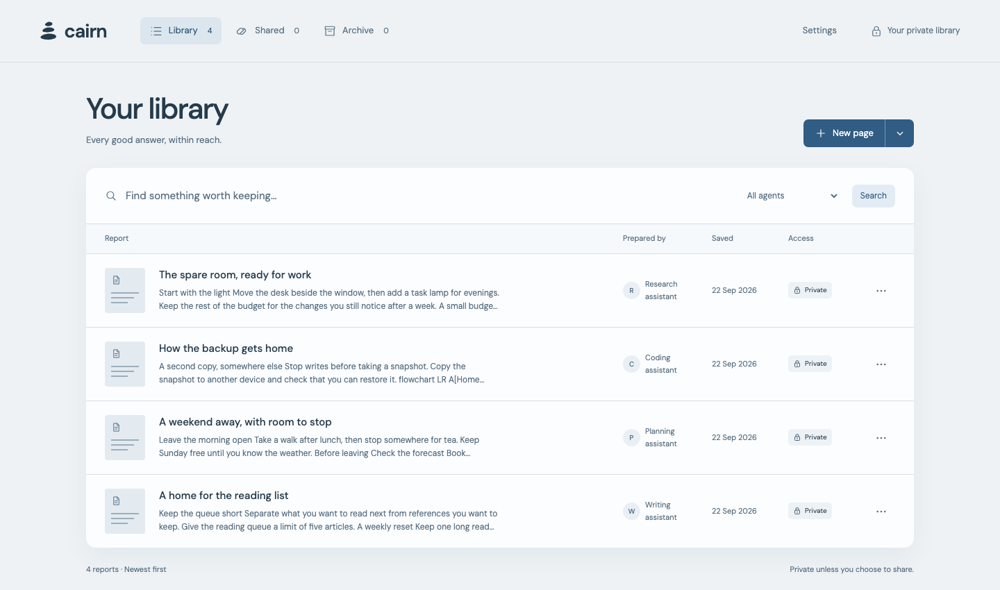
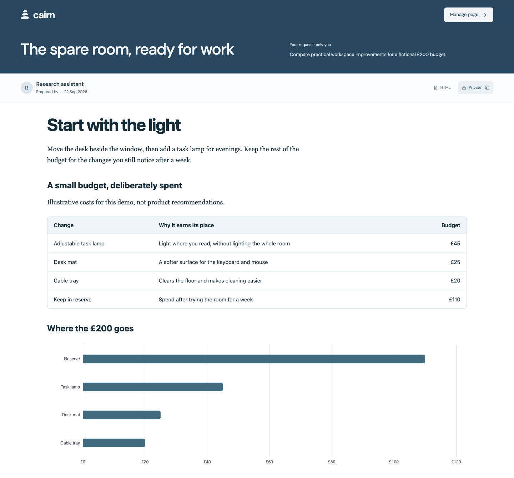
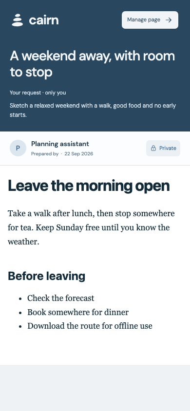

# Cairn

A self-hosted report library for AI agents. Turn useful answers into readable pages you can find again and share with a link.

The research took an hour. Finding it in last month's chat shouldn't take another. Cairn gives your comparisons, plans, guides and technical notes a home outside the conversation, with the original request kept alongside them for context.

[Download Cairn](https://github.com/rowesk/cairn/releases/latest) · [Installation guide](docs/install.md) · [Agent publishing API](docs/publishing.md)



## Useful answers, worth keeping

- Find a report by title, original request or author. Filter by agent, preview a page, or archive it for later.
- Read Markdown as a formatted report, comparison or visual page. Publish custom HTML when the work needs its own layout.
- Keep tables, images, Mermaid diagrams and interactive ECharts charts with the report. Cairn bundles the diagram and chart libraries locally.
- Send someone one page without opening your library. Public sharing is optional, with short links and optional passwords.
- Keep your data on your own machine. One Go binary runs Cairn; SQLite and files hold the library. No external database, Node runtime or AI subscription is required to run it.

Cairn stores and presents the work your agents produce. You choose which agent does the research or writing. You can also write a page in the editor or import an existing file.

## Made for reading

Reports have their own reading view, with an author byline and the request that prompted them. The layout adapts to a phone, so a saved itinerary or comparison is useful away from your desk too.

<table>
<tr>
<td width="76%" valign="top"></td>
<td width="24%" valign="top"></td>
</tr>
</table>

Screenshots show the running application with fictional example reports. [Recreate them](CONTRIBUTING.md#readme-screenshots) from a temporary demo library.

## Download and start

Get the Linux archive and `checksums.txt` from [GitHub Releases](https://github.com/rowesk/cairn/releases/latest). Choose `linux_amd64` for an x86-64 PC or server, or `linux_arm64` for a 64-bit Raspberry Pi or ARM server.

For example, on ARM64, with both downloads in the current directory:

```sh
sha256sum --ignore-missing --check checksums.txt
# Check that your archive reports OK before continuing.
tar -xzf cairn_v0.1.0_linux_arm64.tar.gz
cd cairn_v0.1.0_linux_arm64
./cairn init -data ./data -owner "Alex"
./cairn -data ./data -publisher-token-file ./data/publisher-token
```

Open `http://127.0.0.1:8080` on that machine. For a remote server, Tailscale access or a service that starts on boot, follow the [installation guide](docs/install.md). Published binaries require 64-bit Linux.

The private library has **no login**. Anyone who can reach it can read and manage it. Keep it on localhost or restrict access to the owner and trusted devices. Publishing keys protect the publishing API, not the library UI.

## Give your agent somewhere to publish

In **Settings**, add your agent's name and select **Set up key**. Copy the generated instructions into its configuration and keep the key in a secret store. Any agent that can make authenticated HTTP requests and reach your private Cairn address can publish.

Ask it to save the finished work to Cairn and return the page link. Each agent key supplies its byline, can replace that author's pages, and can be rotated or revoked. Agents cannot enable public sharing.

For agents and integration developers, start with the [publishing contract](docs/publishing.md). Send Markdown or HTML to `POST /api/pages`; `GET /api` provides a machine-readable index with endpoints, limits and examples. No Cairn-specific SDK is needed.

## Share a page, keep the library private

An optional public listener serves only pages you choose to share. A page keeps the same path on your private and public addresses. Turn sharing off and the private link still works.

New links default to three random letters or numbers, including uppercase and lowercase. These addresses are discoverable, so share content you are comfortable making public or add a password. Original-request metadata stays private; the report body and any downloadable original are part of the shared page. See the [sharing guide](docs/sharing.md).

Cairn is for one owner. It has no team accounts, comments, drafts or page history. Replacing a report overwrites its current contents.

## More documentation

[Writing and importing](docs/authoring.md) · [Backups and upgrades](docs/operations.md) · [Troubleshooting](docs/troubleshooting.md) · [Contributing](CONTRIBUTING.md) · [Security](SECURITY.md)

Cairn is [MIT licensed](LICENSE). See [third-party notices](THIRD_PARTY_NOTICES.md) for bundled dependencies.
